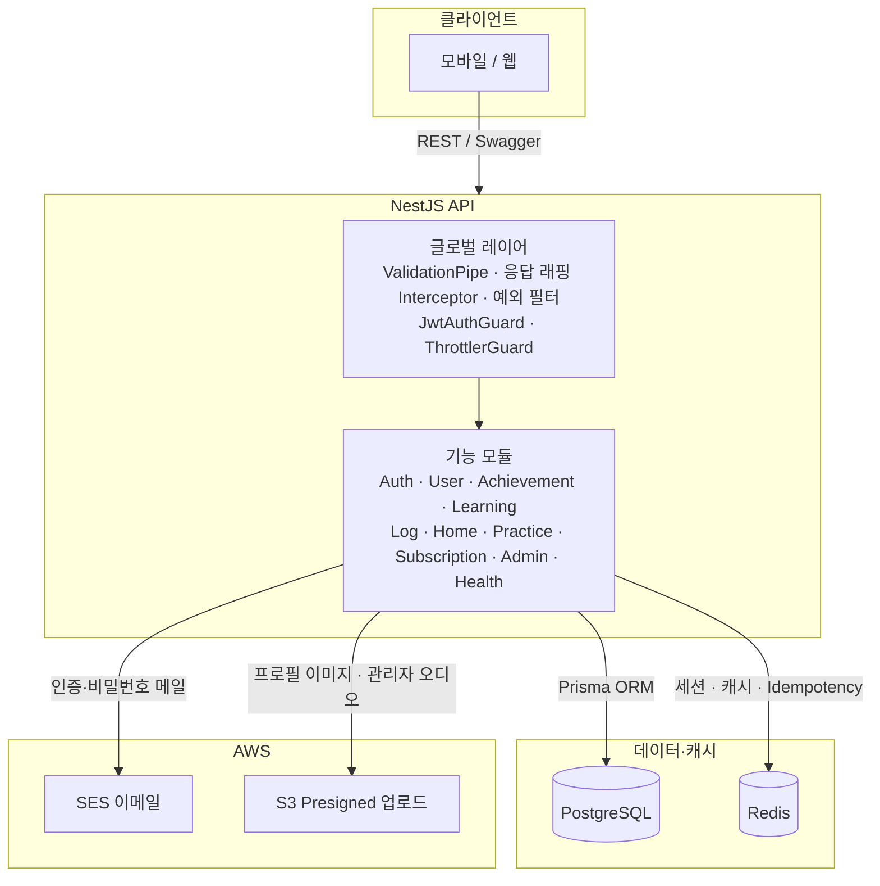

# DOJEON Backend

외국인 대상 한국어 학습 플랫폼 API (NestJS + Prisma + PostgreSQL).

## 아키텍처

클라이언트는 HTTPS로 REST API를 호출하고, 서버는 Prisma로 PostgreSQL에 접근하며 Redis·AWS 서비스와 연동합니다.



## 요구 사항

- Node.js 20+
- Docker (로컬 PostgreSQL / Redis)

## 빠른 시작

1. 의존성 설치

```bash
npm install
```

2. 환경 변수

`.env.example`을 복사해 `.env`를 만들고 `DATABASE_URL`, `REDIS_URL`, `JWT_*` 등을 설정합니다.

3. 로컬 DB (PostgreSQL + Redis만 — 호스트에서 `npm run start:dev` 할 때)

`.env`에 `POSTGRES_PASSWORD`를 두고 `DATABASE_URL`의 비밀번호와 맞춥니다.

```bash
docker compose up -d
```

API까지 컨테이너로 띄우려면 `COMPOSE_PROFILES=api docker compose up -d --build` — 자세한 내용은 `DOCKER.md` 참고.

4. 스키마 반영 및 시드

```bash
npx prisma generate
npx prisma migrate dev
npm run prisma:seed
```

(또는 `npm run prisma:push`로 스키마만 동기화)

5. 개발 서버

```bash
npm run start:dev
```

API 베이스 URL: `http://localhost:3000`

## 응답 포맷

모든 성공 응답은 Global Interceptor로 아래 형태로 래핑됩니다.

```json
{
  "isSuccess": true,
  "code": "200",
  "message": "요청이 성공했습니다.",
  "data": {},
  "timestamp": "2026-04-03T00:00:00.000Z"
}
```

## 주요 엔드포인트

| 영역 | 메서드 | 경로 |
|------|--------|------|
| Auth | POST/GET | `/auth/email/send`, `/auth/email/verify`, `/auth/signup`, `/auth/login`, `/auth/google`, `/auth/reissue`, `/auth/logout`, `/auth/password/reset-request`, `/auth/check-nickname` |
| User | GET/PATCH | `/user/me?year=&month=`, `/user/me/achievement`, `/user/me/profileImage/presignedUrl` |
| Home | GET | `/home/resume` |
| Learning | GET | `/courses/dashboard`, `/lessons/:id/sections` |
| Section | GET/POST | `/section/:id/material`, `/section/:id/card`, `/section/:id/question`, `/section/:id/progress` (Idempotency-Key) |
| Scrap | GET/POST/DELETE | `/scrap/dashboard`, `/scrap?type=VOCAB` 또는 `GRAMMAR` + `sort=recent`, `/scrap`, `/scrap/:scrapId` |
| Practice | GET | `/practice/topic`, `/practice/topic/:topicId/question` |
| Subscription | GET | `/subscription/plan` |

## 구현 상태 체크리스트

아래는 **코드베이스 기준** 구현 여부입니다. 배포·AWS 콘솔 작업은 별도 표기합니다.

### 데이터·스키마

- [x] Prisma 스키마: `SectionCard` / `SectionMaterial` / `SectionQuestion`, `Practice*`, `SubscriptionPlan`, Scrap 정규화
- [x] 마이그레이션 SQL (`prisma/migrations/`)
- [x] 시드: 배지, 구독 플랜, 샘플 코스·섹션 카드·머티리얼, 연습 토픽
- [ ] (선택) 기존 DB에서 `Section.content` JSON → 분리 테이블로 이전하는 전용 스크립트

### API 도메인 (NestJS)

- [x] **Auth** — 이메일 인증, 회원가입, 로그인, Google, 토큰 재발급, 로그아웃, 비밀번호 재설정 요청, 닉네임 중복 확인
- [x] **User** — `GET/PATCH /user/me`, 출석 `year`/`month`, 업적, 프로필 이미지 presigned URL
- [x] **Home** — `GET /home/resume`
- [x] **Learning** — 코스 대시보드(`resumeBanner`, 비활성 코스), 레슨 섹션 목록, `getLastLessonResume` 공통 로직
- [x] **Section** — material / card / question 조회, 진행률 저장(`nextSection`, `difficulty`)
- [x] **Scrap** — 대시보드, 통합 리스트(`type`, `sort`, `cursor`, `limit`), 생성·삭제, DTO 조건부 검증
- [x] **Practice** — 토픽·문항 조회
- [x] **Subscription** — 플랜 목록 + `benefits`

### 공통·인프라 (코드)

- [x] Global 응답 래핑
- [x] Redis (세션·캐시·idempotency)
- [x] **EmailService** (AWS SES) — 인증 코드·임시 비밀번호 메일 (개발 시 로그 폴백)

### 배포·운영 연동 (저장소 밖 작업)

- [ ] PostgreSQL에 `prisma migrate` 적용 및 운영 `DATABASE_URL` 설정
- [ ] Redis, S3 버킷 등 AWS 리소스 연결
- [ ] **AWS SES** 발신 도메인/주소 검증, Sandbox 해제(필요 시)
- [ ] (선택) ECS/CI 파이프라인, 단위 테스트 추가

### 문서

- [x] `PROGRESS.md` — 상세 진행·후속 작업

---

## 프로덕션 빌드

```bash
npm run build
npm run start:prod
```

## Docker 이미지

```bash
docker build -t dojeon-back .
```

ECS 배포 시 `DATABASE_URL`, `REDIS_URL`, `JWT_*`, `AWS_*` 등을 태스크 정의에서 주입합니다.
